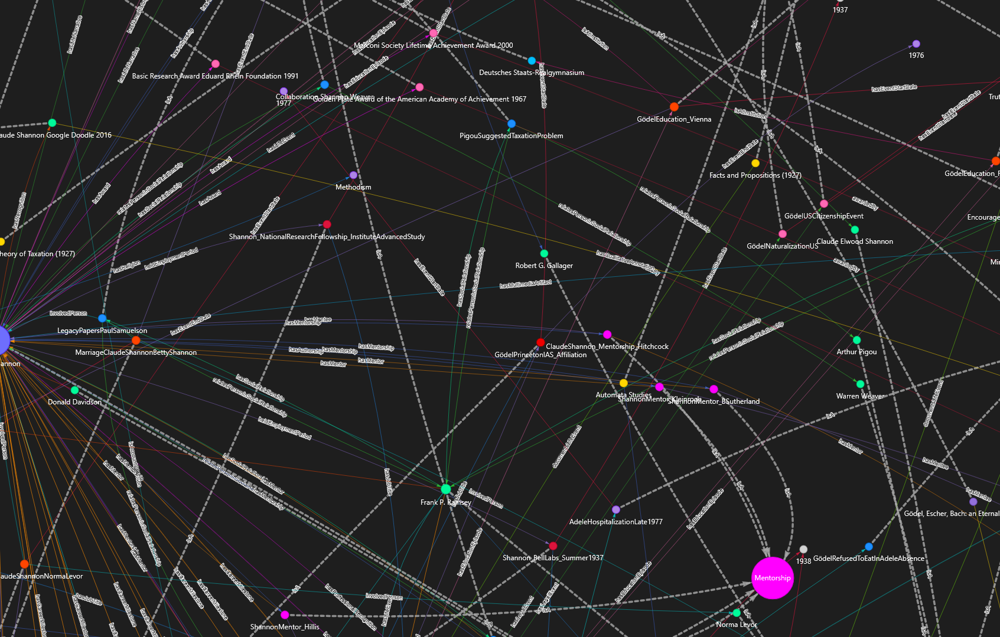

# Research Ontology

> An advanced tool for generating, visualizing, and evaluating domain-specific knowledge graphs and ontologies.

<div align="center">
  
</div>

## About

ontopipe is a powerful framework for generating domain-specific ontologies and knowledge graphs. It uses a committee-based approach with AI personas to comprehensively scope domains, generate ontological structures, and create knowledge graphs that can be used for various applications including question answering and domain exploration.

The framework combines symbolic AI techniques (using the [symbolicai](https://github.com/ExtensityAI/symbolicai) framework) with large language models to create structured representations of domain knowledge that are both human-readable and machine-actionable.

## Setup

To set up the environment, install the Python package manager [uv](https://github.com/astral-sh/uv).

Then, create a virtual environment and install the dependencies by running:

```bash
$ uv sync --all-packages
```

_Note: It is important to use the `--all-packages` parameter as the evaluation framework is located in a separate package under `./packages/eval`._

## Usage

### Generating Ontologies and Knowledge Graphs

You can use the ontopipe API to generate ontologies and knowledge graphs for a specific domain:

```python
from ontopipe import ontopipe, generate_kg
from pathlib import Path

# Define the domain and output directory
domain = "biology"
artifacts_dir = Path("./artifacts/biology")

# Generate ontology
ontology = ontopipe(domain, cache_dir=artifacts_dir)

# Generate knowledge graph
kg = generate_kg(ontology, artifacts_dir / "data.txt")

# Visualize the ontology and knowledge graph
from ontopipe.vis import visualize_ontology, visualize_kg

visualize_ontology(ontology, artifacts_dir / "ontology_viz.html")
visualize_kg(kg, artifacts_dir / "kg_viz.html")
```

## Evaluation

First, download the SQuAD v2.0 dataset from [https://rajpurkar.github.io/SQuAD-explorer/](https://rajpurkar.github.io/SQuAD-explorer/) and save it as `./eval/train-v2.0.json`.

Then, use the `new` subcommand to create a new evaluation run:

```bash
$ uv run eval new [--config <file.json>]
```

This will create a new evaluation run under `./eval/runs/<run-id>`, where logs, checkpoints and results will be saved. The `--config` parameter is optional and defines the configuration file used for this evaluation run. The configuration file defines scenarios and parameters for the evaluation. If not provided, the default configuration file `./eval/config.json` will be used.

If you want to resume an evaluation run, you can use the `resume` command:

```bash
$ uv run eval resume --path <path>
```

This will resume the evaluation from the last checkpoint. The path should be the path to the evaluation run folder, e.g. `./eval/runs/<run-id>`.
